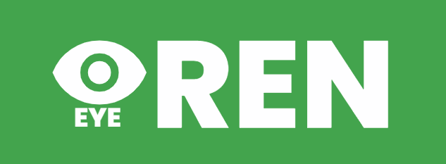
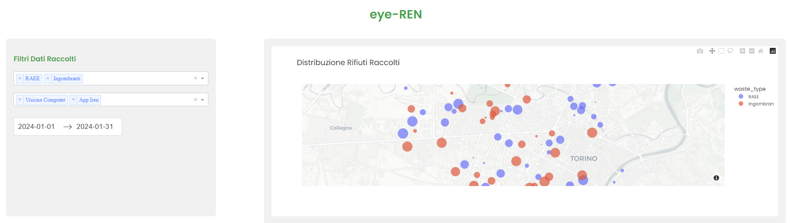
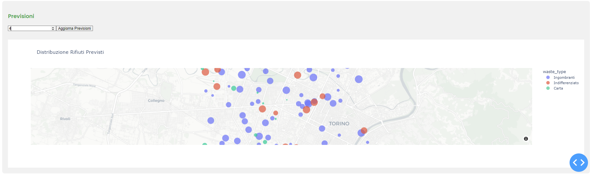
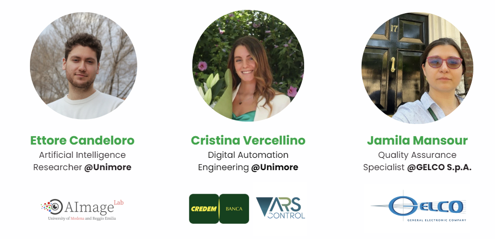
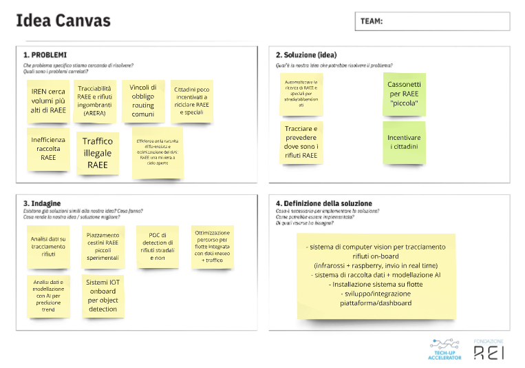
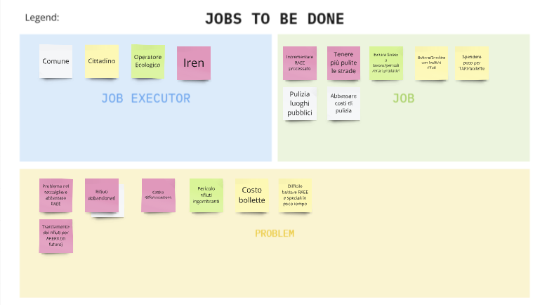

# Reggio Hub Challenge - IREN - Data Valorization for Waste Management

## Iren Group Challenge: Overview

### Company Profile

**Iren Group** is a leading multi-utility company in Italy, operating across diverse sectors including electricity, gas, district heating, integrated water management, environmental services, and technological solutions. The Group employs over **8,600 people**, serves **1.9 million energy customers**, manages water services for **2.8 million inhabitants**, and provides environmental services for **3.1 million inhabitants**. Organized into four business units—Networks, Environment, Energy, and Market—Iren is a trusted partner for public administrations and communities, focusing on sustainable growth and leveraging innovation to meet customer and citizen needs.

### Challenge

The challenge seeks **innovative and sustainable solutions** to improve **waste management** and **plant monitoring** for **Iren Ambiente**. Participants are tasked with processing data collected from vehicles and waste treatment facilities using advanced technologies, such as **neural networks** and **mathematical modeling**, to derive new insights or optimize resources. Proposed solutions should aim to enhance operational performance, reduce environmental impact, or uncover unavailable information. Where applicable, solutions should include modeling, simulation, and data visualization tools to assess performance and illustrate findings.

Read more on the [Reggio Hub Challenge website](https://reggiohub.it/talent-roadshow/)

## Our Proposed Solution

We proposed a smart monitoring system that employs cameras on waste management vehicles.
Using Computer Vision algorithms with Artificial Intelligence, the cameras can identify, classify, and track the position and type of abandoned waste in the streets, sending real-time data to the operational center of IREN.
The data can be aggregated with the already existing one of IREN (like the bins positions and vehicle-optimized routes) to then employ data analysis and extract business intelligence information to:

- identify critical waste areas
- plan new bin installations
- predict with AI algorithm waste position, type
- track waste automatically for the new upcoming ARERA standards
- track bins' condition
- identify anomalies and bottlenecks

Read our [presentation/pitch deck](https://www.canva.com/design/DAGXSwYaIjk/SCSYonaK8hrFkJICOxKFaA/view?utm_content=DAGXSwYaIjk&utm_campaign=designshare&utm_medium=link&utm_source=editor)

## Demo

Our demo simulates, with artificial data, a dashboard to visualize waste on a city map (Turin in our example).
The waste can be filtered and visualized by types with color coding and also by what information channel was used to detect it.
Then, the filtered data can be employed to predict with a Machine Learning model, the future days' positions and types of waste.

### Map

## Predictions of waste position and type

## Our Team

### Contacts:

Follow us on LinkedIn!

- [Cristina Vercellino](https://www.linkedin.com/in/cristina-vercellino-91319522a/)
- [Jamila Mansour](https://www.linkedin.com/in/jamila-mansour-bba31a26b/)
- [Ettore Candeloro](https://www.linkedin.com/in/ettore-candeloro-900081162/)

## Credits

All the credits for the demo application idea and development go to [Cristina Vercellino](https://www.linkedin.com/in/cristina-vercellino-91319522a/)!
Follow her on the Git-Hub page [here](https://github.com/cverce) and [LinkedIn](https://www.linkedin.com/in/cristina-vercellino-91319522a/)!

## Our idea canvas + jobs to be done canvas

### Idea Canvas

### Jobs to be Done Canvas

## Installation of the demo app

Install poetry globally with Python (version 3.10 or more), then use the following commands:

    poetry config settings.virtualenvs.in-project true
    
    poetry install

Then run the project with:

    poetry shell

    python main.py

The server will be launched at localhost (http://127.0.0.1:8050/), so you can visualize it with a browser.

If all is good you will see:

    Dash is running on http://127.0.0.1:8050/
    *Serving Flask app 'main'
    *Debug mode: on
 

